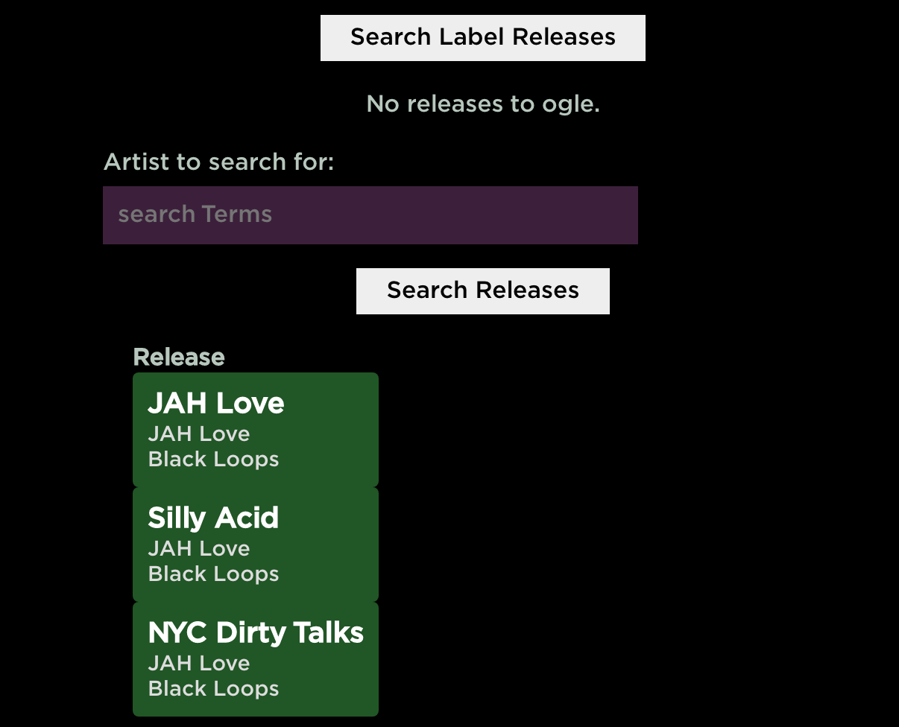

## New Label Releases

> New Label Releases research/crate

## What the app is for

The app is aimed at a user who wishes to keep track of new or recent musical releases, primarily based on record labels. This is due a sort of anti-label bias by streaming services such as Spotify. It's quite difficult to find information about record labels on the service and also difficult to categorise or even search by label. The functionality really doesn't exist.

Yet DJs tend to think about music in terms of these modern day "umbrellas". If one knows of more than 1 release by a label such as "Toy Tonics", or "Shall Not Fade", there's a good chance it might be worth keeping an eye on that label's output in case of any future releases that might also be good. It's not untypical for a label to keep within the same style of releases, "jazzy deep house", "J Dilla style funk", etc

Therefore if a user can keep track of labels, and also the recent releases by those labels, that's likely a good way to sift through the circa 30,000 songs released DAILY to streaming services.

## Approaches and APIs

But how to do this when Spotify is so coy about label info? There's no clean/one size fits all method to doing it. Because of this I ended up with a hybrid approach.

Spotify have a good API for releases/release information, track previews, album art. Discogs are more label focused, but of course they do much more than digital, originally focusing solely on vinyl. In fact they focus on so many formats, their own label now can mean more than just label, it could mean "entity of any kind".

But record hunting has always been an inexact science. This app aims to beat a path through the dross that gets released, to give a 95% look at what one wants, which should be enough to fill hundreds of DJ sets or playlists if so desired.

TODO: Comb through the code and explain exactly the link up I created between Discogs and Spotify.

## Discogs

TODO: Talk about how this app originally focused on Discogs, but it didn't have the information I needed so had to switch tracks.
TODO: That Postman collection could be a project in its own right.

## Technical details

This is a full stack app using React, PostgresSQL, Sequilize, ES7, Hooks, React State, Node/Express etc.

- TODO: Run app, document your steps
- TODO: Include Spotify and Discogs API links.
- TODO: Pull the postgres md file I made on database commands. Have that as appendix?

## Main app components

Adding a label:


Release search and release "crate":


Release search and release "crate":


Release search and release "crate":


## PostgresSQL

Start PGAdmin
If you're running a local copy of the database, create the schemas locally using PGAdmin. More info on PgAdmin here:
https://www.pgadmin.org

## Database schema

The database is called newlabelreleases.

- labels - the labels each user wishes to keep track of
- recordCrates - the tracks the user has identified for further perusal
- users - each user that has access to the system

TODO: When I deploy this elsewhere, give the URL, access info etc.

## Usage

```
change config.env file in config folder
```

```
 npm install
 cd client npm install
 cd ..

 # Run front and backend
 npm run dev

 # Backend only
 npm run server

 # Frontend only
 npm run client

 # Build client
 cd client
 npm run build

 # Prod
 npm start
```
